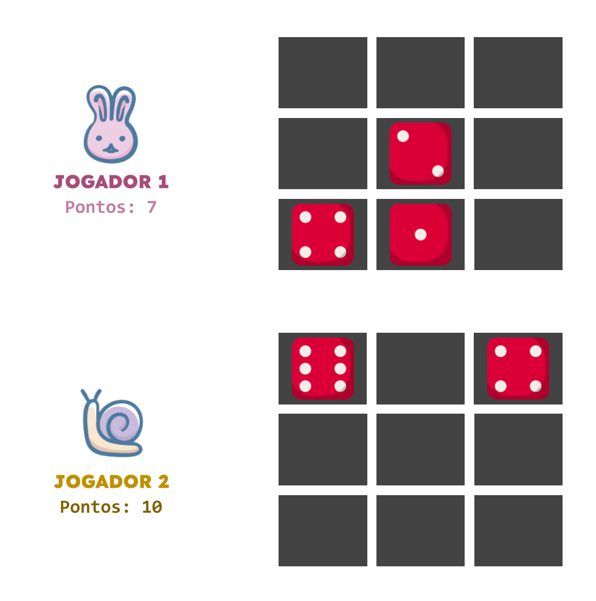

# Exercício Programa 1

O objetivo deste exercício programa (EP) é colocar em prática os conceitos iniciais de programação em Python em um problema um pouco maior do que os exercícios de aula. **Este primeiro EP é individual.**

Neste EP vamos construir uma versão simples para terminal do jogo da bugalha. 

O jogo da bugalha é um jogo de dois jogadores, na qual cada jogador possui um tabuleiro em que deve preencher os espaços com dados e atingir a maior pontuação possível.

A cada turno, cada jogador rola um dado e o posiciona no seu tabuleiro. O valor dos dados posicionados somam para a pontuação do jogador.

Assim que um dos jogadores completar o tabuleiro, o jogo acaba e quem possuir a maior pontuação vence o jogo. 

Se quiser jogar umas partidas para entender melhor o jogo, [clique aqui](https://knucklebones.io/en/){:target="_blank"}.

## Rubrica

Este EP será corrigido **automaticamente**. Ou seja, será considerado o resultado do teste do PrairieLearn e apenas exercícios com sucesso ganharão nota. A nota do EP será dada pela soma das pontuações a seguir:

- [ 1 pontos ] Verifica disponibilidade da linha
- [ 1 pontos ] Faz a jogada
- [ 1 pontos ] Destruição do dado do oponente
- [ 1 pontos ] Verifica o fim do jogo
- [ 1 pontos ] Cálculo das pontuações
- [ 2 pontos ] Correção do tabuleiro
- [ 1 pontos ] Uma rodada do jogo
- [ 2 pontos ] Jogo completo

**Obs.:** Faça os exercícios na ordem apresentada acima.

## Entrega

**O prazo é XX/XX às 23:59**

Não serão aceitas entregas atrasadas ou fora do PrairieLearn.
