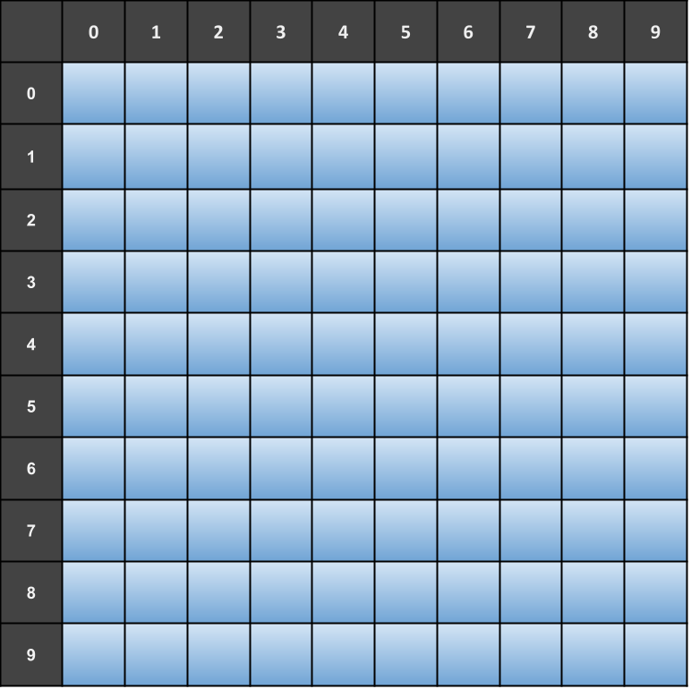

# Exercício Programa - Batalha Naval Simplificada

**Este EP pode ser feito individualmente ou em duplas e deve utilizar o github para registrar o histórico do código e para fazer a entrega (com contribuições de ambos os membros, no caso de duplas).**

**Caso faça em dupla, defina quais exercícios cada integrante ficará responsável.**

**Caso faça individualmente, ainda é necessário utilizar o github e fazer commits ao longo do desenvolvimento do projeto.**

Para exercitar nossas habilidades com programação, vamos desenvolver o jogo *Batalha Naval*.

Nesse jogo, o objetivo do jogador é tentar afundar todos os navios inimigos. É preciso posicionar estrategicamente os navios no começo do jogo e contar com a sorte para afundar os navios do adversário antes dele afundar os seus.

## O jogo

- O primeiro passo do jogo é posicionar um total de `#!python 10` embarcações de diversas posições em um grid de `#!python 10` por `#!python 10`.

- Nesta versão do jogo trabalharemos com `#!python 4` tipos de embarcações diferentes. Cada tipo possui um tamanho, que representa quantos espaços do grid ele ocupa. Veja as embarcações e suas descrições a seguir:

___

Você deve implementar uma versão para terminal (console) do jogo, ou seja, usando `#!python print` e `#!python input` para interagir com o usuário por meio de texto.

Para te auxiliar nessa tarefa, foram criados exercícios no PrairieLearn que te ajudarão a implementar as funções necessárias para o jogo.

## Desenvolvimento do projeto

- Crie um repositório **público** no github para o seu projeto e adicione sua dupla caso haja.
- Cada exercício feito com sucesso no PrairieLearn deve ser adicionado ao repositório em um commit separado no mesmo dia. Dica: crie um arquivo para adicionar essas funções. A cada modificação nesse arquivo, faça um novo commit. Assim, a evolução do programa fica registrada.
- As funções enviadas no PrairieLearn devem ser utilizadas pelo seu programa no EP2. Faça um outro arquivo para o programa que será responsável pela impressão em tela e validação de entrada de dados.

Leia também a rubrica atentamente, pois ela irá te ajudar a entender o que precisa ser feito.

## Rubrica

A tabela a seguir apresenta os requisitos esperados e seus respectivos conceitos associados para os objetivos de aprendizagem **desenvolver de programas de computador** e **identificar e desenhar estratégias algorítmicas computacionais**. Esta tabela deve ser considerada em conjunto com a tabela do objetivo **atuar em uma equipe autogerenciada de desenvolvimento**.

### Conceito I
Não entregou

### Conceito D
Não submeteu no PrairieLearn ou não fez o commit de alguma das funções a seguir:

- Define posições
- Preenche frota
- Faz jogada

### Conceito C
Submeteu com sucesso no PrairieLearn **E** fez o commit das funções a seguir:

- Define posições
- Preenche frota
- Faz jogada

### Conceito B
Atingiu o conceito C
E submeteu com sucesso no PrairieLearn **E** fez o commit das funções a seguir:

- Posiciona frota
- Afundados

### Conceito A
Atingiu o conceito B
E submeteu com sucesso no PrairieLearn **E** fez o commit das funções a seguir:

- Posição válida
- Jogadas do jogador
- Jogadas do oponente

### Conceito A+
Atingiu o conceito A e existem exatamente 2 arquivos no repositório (um para as funções e outro para o código do jogo. Além disso, as funções estão sendo importadas do arquivo que contém as definições das funções).
___

A tabela a seguir apresenta a rubrica do objetivo **atuar em uma equipe autogerenciada de desenvolvimento**.

| Conceito  |  Descrição |
| --------- | :--------: |
| I        | Não entregou. |
| D        | Não possui nenhum commit próprio e nenhuma evidência de trabalho em grupo. |
| C        | O grupo enviou todo o código de uma vez para o git (em um ou poucos commits enviados em um intervalo curto de tempo). |
| B        | Todos os membros do grupo enviaram commits com partes do código, mas a evolução do código é artificial. |
| A        | O grupo fez bom uso do git, enviando commits a cada funcionalidade implementada ou bug corrigido. Os commits são distribuídos ao longo de alguns dias, mostrando a evolução do trabalho. |

**O conceito final do EP2 será dado pelo menor entre os conceitos obtidos para cada objetivo acima.** Ou seja, se você obtiver conceito C no primeiro objetivo e A no segundo, o conceito final será C. Se você obtiver conceito A+ no primeiro objetivo, mas não possuir nenhum commit e nenhuma outra evidência de trabalho em grupo (conceito D), seu conceito final será D.

## Entrega 27/10 até 23:59
Será considerado o código enviado para o github até a data de entrega.

O endereço do seu repositório deve ser enviado pelo Blackboard. Não façam commits após a data de entrega, pois será considerado como atraso.

**Importante:** Caso algum integrante da dupla esqueça de enviar o endereço do repositório, será descontado conceito da nota final do projeto.
