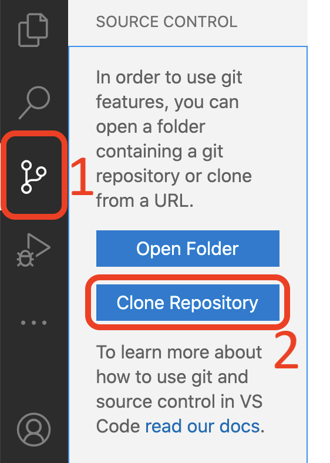
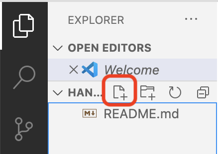

# Instruções para o Desenvolvedor 2

## Criando o repositório no GitHub

1. Espere o desenvolvedor 1 compartilhar a tela com você;
2. Acompanhe a criação do repositório pela tela do desenvolvedor 1 (apenas uma pessoa da dupla vai criar o repositório).

## Adicionando colaboradores no projeto

1. Quando o desenvolvedor 1 pedir, passe o seu nome de usuário do GitHub;
2. Quando o desenvolvedor 1 colar no chat o link com o convite para participar do repositório, acesse o link e aceite o convite.

## Clonando o repositório remoto na sua máquina

Neste momento, o que temos é um repositório no GitHub, com um commit apenas, no qual um arquivo (README.md) foi adicionado. Agora precisamos clonar o repositório no seu próprio computador para que você possa trabalhar com os arquivos! Este passo deve ser executado pelos 2 desenvolvedores. Cada um no seu próprio computador.

:::admonition{type="info" title="[Avançado] Usando o git no terminal" collapse}
Para Design de Software é suficiente que você utilize a extensão do git para o VSCode, que apresentaremos nos próximos passos. Entretanto, para avançar em sua carreira de desenvolvimento de software, será **muito útil** saber utilizar o git através do terminal.

Nós criamos um guia sobre como [navegar pelo terminal](/conteudo/terminal-win) para te ajudar com os primeiros passos. Depois disso, tente reproduzir este handout utilizando o terminal ao invés do VSCode. Cada operação realizada no VSCode pode ser realizada por um comando no terminal: https://git-scm.com/docs/gittutorial

Reforçando: esta é uma forma mais avançada de uso do git. Tente utilizar apenas se estiver confortável com o que trabalhamos até o momento.
:::

Abra o VSCode (se já estiver aberto, feche e abra uma nova janela):

1. Clique no menu de (1) controle de versão na barra lateral (em algumas versões do VSCode ele estará no menu "Explorer") e depois clique no botão (2) "Clone repository":
2. Copie o endereço do seu repositório (que aparece na barra de busca do seu navegador) e cole no campo de texto do VSCode. O endereço será parecido com este: `https://github.com/nome-de-usuario-do-desenvolvedor-1/nome-do-repositorio`
3. Selecione uma localização a criação da sua cópia local do repositório;
4. Abra a pasta do repositório (normalmente o VSCode pergunta se você quer abrir logo depois de clonar o repositório - se isso não acontecer, abra a pasta pelo menu `File -> Open`).

:::admonition{type="info" title='O que fazer se não existir o botão "Clone Repository"'}
É possível que o botão "Clone Repository" não tenha aparecido para você. Nesse caso, existem outras duas possibilidades. Ao abrir o VSCode, na tela de boas vindas, você também pode encontrar a opção "clone repository" como um link:

Uma terceira opção é apertar a tecla `F1`, digitar `git clone`, selecionar a opção desejada com o teclado (provavelmente a primeira) e apertar enter:

:::

Parabéns, você acaba de clonar o repositório no seu computador!

## Mais um pouco de configuração

Só falta configurarmos o seu nome e e-mail para que as suas modificações (*commits*) sejam identificadas com as suas informações.

1. Abra o terminal do VSCode através do menu `Terminal -> New Terminal`;
2. Digite o comando a seguir, substituindo `Seu Nome` pelo seu nome (mantenha as aspas): `git config --global user.name "Seu Nome"`
3. Digite o comando a seguir, substituindo `seuemail` pelo seu endereço de e-mail (novamente, não se esqueça das aspas): `git config --global user.email "seuemail"`

Agora sim, tudo pronto para começarmos a usar o git!

## Fazendo seu primeiro commit

Um commit é um registro do repositório em um dado momento. Cada commit é uma versão do seu repositório para a qual você pode retornar caso necessário. Nesta seção vamos fazer o nosso primeiro commit. As instruções a partir deste ponto são ligeiramente diferentes para cada um dos desenvolvedores, então é importante que você as siga com atenção.

Crie um arquivo chamado `dev2.py` dentro da pasta do repositório que você clonou pelo VSCode:

:::admonition{type="danger" title="Importante"}
O arquivo precisa ser criado dentro da pasta do repositório. Caso contrário o git não será capaz de encontrá-lo.
:::

Nesse novo arquivo, adicione uma linha de código que imprime o seu nome no terminal. Lembre-se de sempre salvar o arquivo.

Na barra de opções, na esquerda da janela do VSCode, deve ter aparecido o número 1 dentro de um círculo azul. Isso quer dizer que você possui 1 arquivo diferente da última versão salva (ou seja, do último commit). Ao clicar nesse botão (botão 1 na imagem abaixo), o arquivo que você criou estará listado em "Changes" (2).

Como dissemos anteriormente, o commit é um registro do estado do repositório em um dado momento. Para criarmos um commit é necessário indicar para o git quais arquivos, dentre os arquivos modificados, nós queremos considerar. Esse passo é necessário porque você pode querer registrar as mudanças em alguns arquivos, mas deixar outros que ainda esteja trabalhando para um próximo commit. Para adicionar um arquivo ao próximo commit, clique no botão `+`. Ele deve sair da lista "Changes" e entrar na lista "Staged Changes", que são os arquivos que entrarão no próximo commit (1). Depois de adicionar o arquivo, digite uma mensagem no campo de texto (2). Ela é necessária para identificar o que foi feito nesse commit. Escreva: `Primeiro commit do/da SEU NOME` (substituindo `SEU NOME` pelo seu próprio nome). Finalmente, finalize o commit clicando no ✓ (3).

Parabéns! Você fez o seu primeiro commit. Isso significa que acabou? Hmm... ainda não. No começo do handout nós comentamos que existe um repositório remoto, armazenado no GitHub e você criou um clone/cópia local desse repositório no seu computador. Assim, o commit que você acabou de fazer existe apenas na sua cópia local, mas ainda não está disponível para os seus companheiros de trabalho.

Mas antes de prosseguir, espere o OK do desenvolvedor 1.

Para enviar as suas modificações para o repositório remoto precisamos fazer a operação *push*. Note que na barra inferior da janela do VSCode apareceu um número 0 ao lado de uma seta apontando para baixo e um número 1 com uma seta apontando para cima:

A seta apontando para baixo indica que existem zero modificações novas no repositório remoto. A seta apontando para cima indica que existe uma modificação a ser enviada para o repositório remoto. Aperte esse botão (sim, é um botão) e espere. Essa pode ser uma operação demorada. Quando a animação terminar significa que as modificações foram enviadas.

É possível que o VSCode apresente a seguinte pergunta:

Você pode responder `Yes`, isso vai facilitar a sua vida. Depois que a animação terminar, você pode verificar que o seu commit foi enviado acessando o seu repositório pelo navegador:

Note que existe um outro arquivo disponível, o `dev1.py`, que não existia antes. Isso aconteceu porque o desenvolvedor 1 já havia feito um commit com esse arquivo. Quando você clicou no botão de atualizar, essa modificação foi recebida do repositório remoto.

Dê um OK para o desenvolvedor 1. Agora ele vai receber o seu arquivo `dev2.py`.

## Gerenciando conflitos de versão

É possível que mais do que um membro da equipe modifique o mesmo trecho de código. Quando isso acontecer, e provavelmente vai, será necessário fazer um *merge*, ou seja, juntar as modificações geradas pelos dois membros da equipe. Vamos gerar um conflito de propósito para aprendermos como lidar com ele. Mas a primeira dica é: quando isso acontecer, não entre em pânico, no começo as mensagens de erro assustam um pouco mesmo.

Vamos começar gerando um conflito para você resolver. Abra o arquivo `dev1.py` e modifique o `print` para que ele imprima o seu nome ao invés do nome do desenvolvedor 1.

:::admonition{type="danger" title="Importante"}
É muito importante que você **modifique** a linha existente e não crie uma nova. Caso contrário o conflito não será gerado.
:::

Aguarde o OK do desenvolvedor 1.

Depois de receber o OK do desenvolvedor 1, compartilhe sua tela.

Adicione o arquivo `dev1.py` no commit, escreva uma mensagem, faça o commit e depois o push (ou seja, repita o processo da seção anterior). Quando você tentar sincronizar os repositórios (fazer o *push*), ocorrerá um conflito e o arquivo `dev1.py` terá um conteúdo parecido com o seguinte:

As linhas em conflito são delimitadas por `<<<<<<<<`, `=========` e `>>>>>>>>`. O que está entre o `<<<<<<<<` e o `=========` são as suas modificações (commits) locais. O que está entre o `=========` e o `>>>>>>>>` são as modificações (commits) remotos, que no caso foram adicionados pelo desenvolvedor 1. O git não sabe como juntar essas duas modificações, então ele gera o conflito e pede para que você resolva.

Você tem 3 opções:

1. Utilizar a sua versão
2. Utilizar a versão do repositório remoto
3. Utilizar ambas as versões. Nesse caso, a versão final do seu código será composta por duas linhas.

Selecione "Accept Current Change" (mas se quiser testar alguma das outras opções, fique à vontade). Como você precisou tomar uma decisão sobre como juntar (*merge*) as versões do código, é necessário fazer um novo commit e *push*. Nesse caso, o git já criou uma mensagem para você, mas você pode alterá-la se quiser.

Dê um OK para o desenvolvedor 1 e deixe que ele compartilhe a tela com você. Agora é a sua vez de esperar pelo OK do desenvolvedor 2.

Depois que receber o OK, vamos gerar um conflito para que o desenvolvedor 1 resolva. Para isso, abra o arquivo `dev2.py` e modifique o seu `print` para que ele imprima o seu nome completo (se já estiver com o nome completo, modifique para apenas o primeiro nome).

Adicione esse arquivo no commit, escreva uma mensagem, faça o commit e depois o push.

Dê o OK para o desenvolvedor 1 e espere pelo OK dele.

Compartilhe a tela com o desenvolvedor 1. Atualize o seu repositório local (*pull*) com o *merge* feito pelo desenvolvedor 1 clicando no mesmo botão de sincronização da imagem acima. Verifique que o arquivo `dev2.py` contém o código atualizado com o nome do desenvolvedor 1 (ou qualquer modificação que ele tenha feito).

## Pronto!

Sim, é bastante informação. O git é uma ferramenta extremamente poderosa e útil, mas é necessário alguma prática para dominá-lo. Com o que vimos hoje você já deve conseguir realizar boa parte das atividades do dia-a-dia com o git. Quando acontecer algum imprevisto ou algo que você não saiba resolver, não entre em pânico. É bastante provável que seja um problema comum e você pode procurar pela solução na internet. Senão, nós, os seus professores, estamos à disposição para ajudar :)
