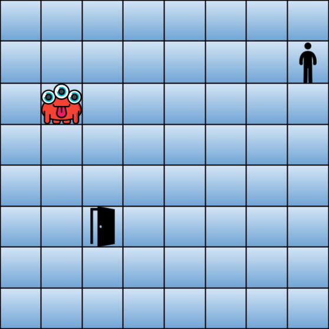

# Exercício Programa 1

O objetivo deste exercício programa (EP) é colocar em prática os conceitos iniciais de programação em Python em um problema um pouco maior do que os exercícios de aula. **Este primeiro EP é individual.**

Neste EP vamos construir um jogo simples para terminal. O objetivo deste jogo é conseguir encontrar a porta para escapar em segurança. Mas além de procurar pela porta o jogador deve tomar cuidado para não encontrar com o monstro no meio do caminho. Se o jogador encontrar a porta ele ganha!

Porém, a tarefa não é tão simples quanto parece, pois o jogador não sabe as posições do monstro e porta. Desta forma, o jogador deve andar pelo tabuleiro as cegas.

Vamos utilizar a referência de posição do jogador, monstro e porta com as coordenadas *x* e *y*. Além disso, a posição `#!python (0, 0)` do tabuleiro está localizada no canto superior esquerdo.

Veja um exemplo na figura abaixo. (**Obs.:** Note que a figura abaixo é somente um exemplo e o jogo pode ter tamanho *N* por *M* onde *N* representa o tamanho do eixo *x* e *M* representa o tamanho do eixo *y*)

No exemplo acima, o jogador se encontra na posição `#!python (7, 1)`, o monstro se encontra na posição `#!python (1, 2)` e a porta se encontra na posição `#!python (2, 5)`.

## Movimentação do Jogador

A cada turno o jogador anda um espaço, podendo ir para cima, para baixo, esquerda e direita. O jogador não pode se movimentar para espaços nas diagonais.

Para movimentar o jogador, utilizaremos as teclas *W*, *A*, *S* e *D*.

- **W:** A tecla *W* será utilizada para mover para *cima*;
- **S:** A tecla *S* será utilizada para mover para *baixo*;
- **A:** A tecla *A* será utilizada para mover para a *esquerda*;
- **D:** A tecla *D* será utilizada para mover para a *direita*;

## Movimentação do Monstro

Assim como o jogador, o monstro anda um espaço, podendo ir para cima, para baixo, esquerda e direita. E também não pode se movimentar para espaços nas diagonais.

A movimentação monstro é controlada pelo jogo. O monstro sabe a posição do jogador e sempre vai tentar andar em direção ao jogador.

## Jogo versão terminal

Como mencionado no começo, o jogo será desenvolvido para terminal. Desta forma, para o tabuleiro no estado a seguir:

O mesmo estado do jogo será representado da seguinte forma via terminal:

- **M** representa o Monstro
- **J** representa o Jogador
- **P** representa a Porta

(**Obs.:** Note que estamos implementando o jogo de forma simplificada. Desta forma, estamos deixando de fazer várias validações.)

## Rubrica

Este EP será corrigido **automaticamente**. Ou seja, será considerado o resultado do teste do PrairieLearn e apenas exercícios com sucesso ganharão nota. A nota do EP será dada pela soma das pontuações a seguir:

- [ 1 pontos] Valida as entradas do jogador
- [ 2 pontos] Atualiza a posição do jogador
- [ 1 pontos] Verifica se o jogador encontrou a porta
- [ 3 pontos] Bússola
- [ 2 pontos] Movimenta o monstro
- [ 1 pontos] Verifica se o monstro encontrou o jogador

**Obs.:** Faça os exercícios na ordem apresentada acima.

## Entrega

**O prazo é 13/09 às 23:59**

Não serão aceitas entregas atrasadas ou fora do PrairieLearn.
